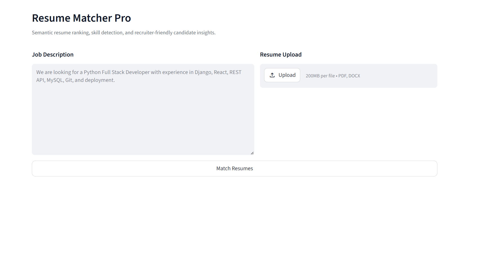
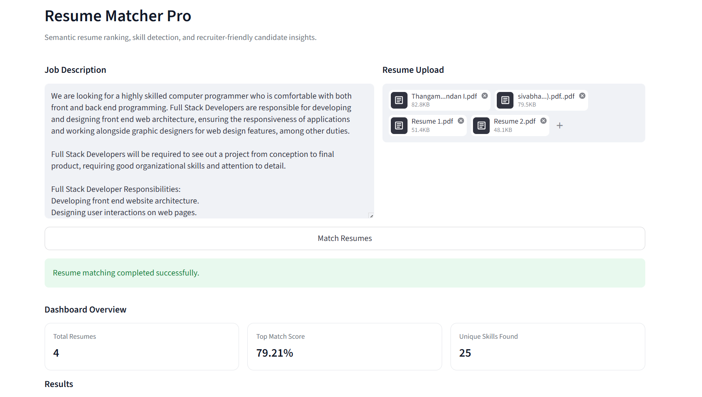
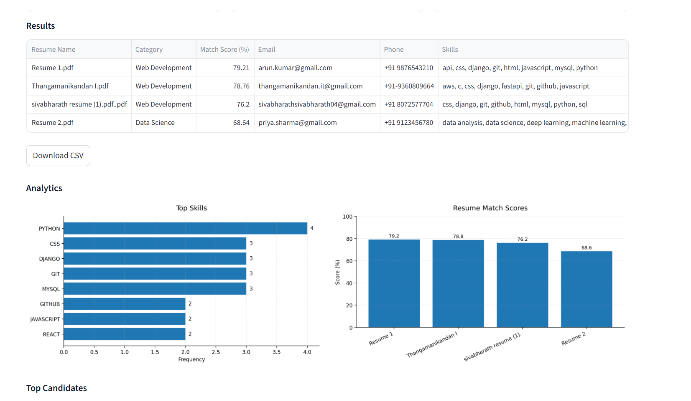
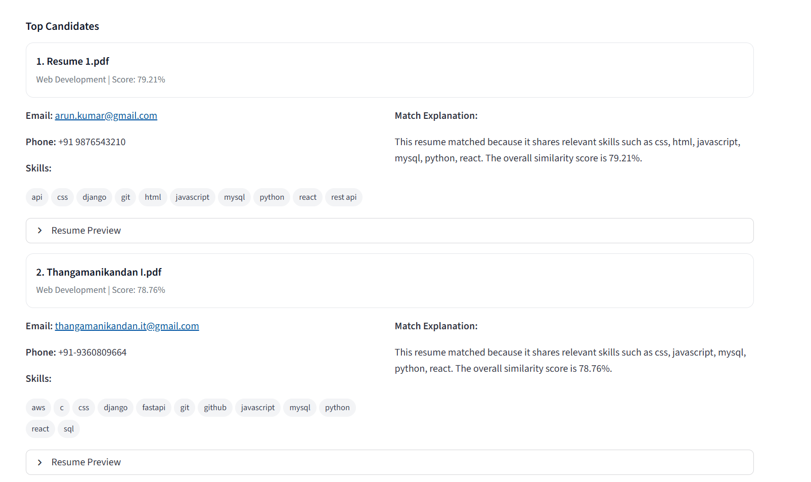

#  Resume Matcher Pro

An AI-powered web application that intelligently matches resumes with job descriptions using Natural Language Processing (NLP).

This system helps recruiters quickly identify the best candidates by analyzing semantic similarity between resumes and job requirements.


##  Features

-  Upload multiple resumes
-  Supports **PDF** and **DOCX** formats
-  AI-based semantic matching using pretrained NLP models
-  Resume ranking based on similarity score
-  Basic resume category classification
-  Visualization of matching scores
-  Export results as CSV
-  Intelligent comparison between job description and resumes


##  Tech Stack

### Frontend
- Streamlit (Python UI)

### Backend / AI
- Python
- NLP (Hugging Face Transformers)
- Sentence Transformers

### Model Used
- `sentence-transformers/all-MiniLM-L6-v2`


##  How It Works

1. Upload resumes
2. Enter job description
3. System converts text into embeddings
4. Calculates similarity scores
5. Ranks resumes based on relevance


##  Screenshots


  


##  How to Run

### 1. Create Virtual Environment
```bash
python -m venv venv
```

### 2. Activate Environment
```bash
venv\Scripts\activate
```

### 3. Install Required Packages
```bash
pip install -r requirements.txt
```

### 4. Run the Project
```bash
streamlit run app.py
```


##  Project Goal

### This project demonstrates:

- Real-world use of AI in recruitment
- NLP-based semantic similarity matching
- Building intelligent automation tools

  
### Future Improvements

- Gmail integration
- OCR support for scanned resumes
- Advanced skill extraction
- ATS (Applicant Tracking System) integration
- Email notification system
